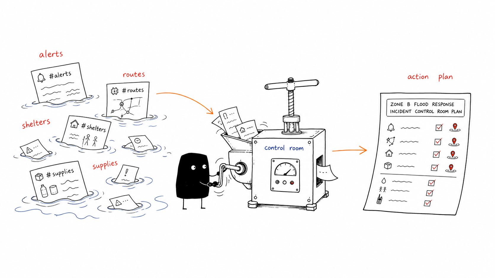
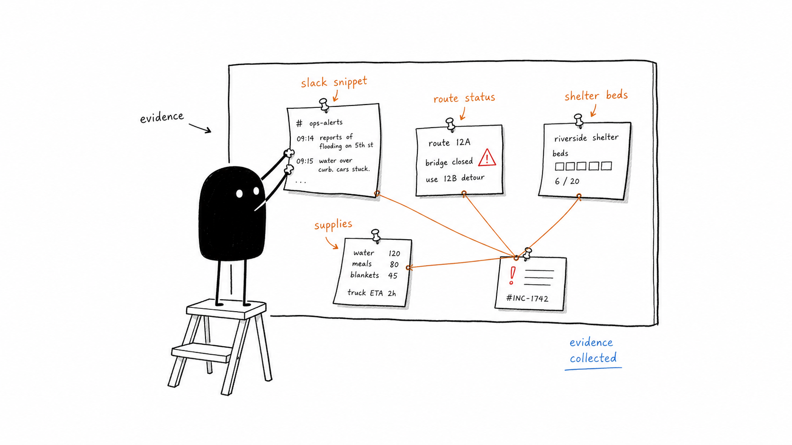
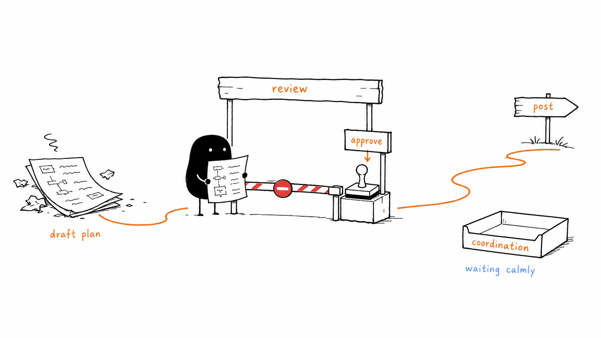
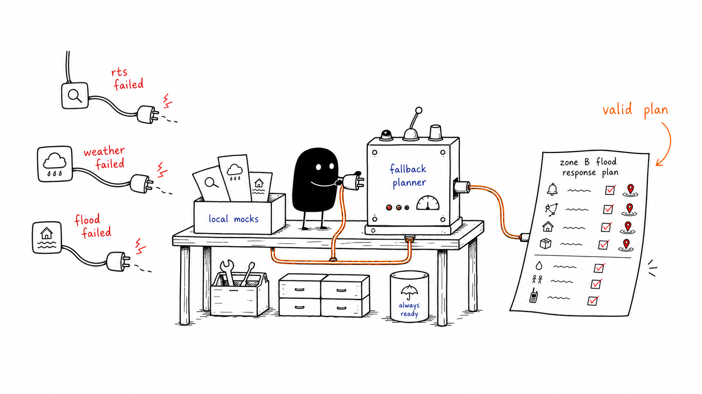

# SentinelSwarm

**A Slack-native crisis coordination agent for monsoon flood response.**

Built for the Slack Agent Builder Challenge, SentinelSwarm turns scattered Slack updates from responders, route teams, shelters, supply coordinators, volunteers, and risk signals into one evidence-linked Incident Control Room. A human coordinator reviews the plan, approves it, and only then posts the final action plan to `#coordination`.

The demo is intentionally focused: **Zone B monsoon flood response** for a campus, NGO, or volunteer operations team.



## Why SentinelSwarm

During a fast-moving flood response, the hard part is not only knowing that something happened. It is finding the right context quickly enough to act safely:

- Which Slack reports are about the same incident?
- Which route is blocked, and which one is still usable?
- Which shelter has capacity?
- Which volunteers and supplies match the need?
- What evidence supports the recommendation?
- Who approved the final plan?

SentinelSwarm keeps that workflow inside Slack. It uses Slack Real-Time Search when available, combines the retrieved context with local operational data and weather/flood signals, and renders a concise Block Kit control room that is built for human review.

## Product Demo

The main interaction is one Slack mention:

```txt
@SentinelSwarm analyze Zone B risk
```

SentinelSwarm replies in thread with an Incident Control Room that includes:

- Risk summary for Zone B.
- Source status for Slack context, weather, flood, and planner mode.
- Evidence Ledger with cited report snippets.
- Priority incidents and severity ranking.
- Route conflicts and safer route suggestions.
- Shelter, volunteer, and supply matches.
- Recommended action plan.
- Human approval controls.
- Decision-support disclaimer.



## 3-Minute Judge Flow

1. Show Slack chaos across `#alerts`, `#field-reports`, `#routes`, `#shelters`, `#supplies`, and `#volunteers`.
2. In `#field-reports`, run `@SentinelSwarm analyze Zone B risk`.
3. Review the Incident Control Room: evidence, risk signals, severity, routes, shelter, volunteers, supplies, and recommended plan.
4. Add a changed route update and click `Refresh Analysis` to prove the plan can update from Slack context.
5. Click `Approve Plan`.
6. Click `Post to Coordination`.
7. Show the final approved action plan in `#coordination`.



## What Makes It Slack-Native

- **Starts from a real Slack mention.** The primary demo trigger is `app_mention`, which is the safest path for Slack Real-Time Search because the event can provide the required action token.
- **Searches Slack context.** SentinelSwarm attempts `assistant.search.context` before falling back to deterministic local context.
- **Uses Block Kit as the control surface.** The plan is not a generic chatbot paragraph; it is a Slack Incident Control Room with sections, evidence, source statuses, and buttons.
- **Requires human approval.** The app never posts final assignments automatically.
- **Posts where teams coordinate.** Approved plans are sent to `#coordination` as clean responder-ready instructions.

## Roadblock-Safe By Design

The demo continues to work even when external services fail. Every dependency has a deterministic fallback:

| Dependency | Primary path | Fallback |
| --- | --- | --- |
| Slack context | Real-Time Search via `assistant.search.context` | `src/data/mockContext.json`, optionally enriched by live channel scan |
| Weather | Open-Meteo weather API | `src/data/mockWeather.json` |
| Flood risk | Open-Meteo flood API | `src/data/mockFlood.json` |
| Planning refinement | Optional Gemini adapter | Deterministic fallback planner |
| LLM JSON | Zod-validated structured output | One schema retry, then fallback planner |
| Final posting | Configured `SLACK_COORDINATION_CHANNEL_ID` | Readable Slack setup hint |



## Tech Stack

- Node.js 20+
- TypeScript strict mode
- Slack Bolt for JavaScript
- Slack Socket Mode
- Slack Web API and Real-Time Search
- Zod schemas for runtime validation
- Local JSON operational data
- Open-Meteo weather and flood signals
- Optional Gemini refinement with deterministic fallback
- Vitest test suite

## Quick Start

### 1. Install Dependencies

```bash
npm install
```

### 2. Create A Slack App

Create a Slack app from [manifest.yaml](manifest.yaml), then enable Socket Mode and install the app to your Slack developer sandbox.

The manifest requests the core bot scopes used by the demo:

- `app_mentions:read`
- `channels:join`
- `channels:read`
- `channels:history`
- `chat:write`
- `search:read.public`

Full setup notes are in [docs/SLACK_SETUP.md](docs/SLACK_SETUP.md).

### 3. Configure Environment

Copy [.env.example](.env.example) to `.env` and fill in:

```txt
SLACK_BOT_TOKEN=xoxb-...
SLACK_APP_TOKEN=xapp-...
SLACK_COORDINATION_CHANNEL_ID=C...
SENTINEL_FORCE_MOCKS=false
SENTINEL_USE_LLM=false
```

For the most reliable judged demo, keep `SENTINEL_USE_LLM=false`. Gemini is optional and not required for the main workflow.

### 4. Create Demo Channels

Create these public Slack channels and invite SentinelSwarm to each one:

```txt
#alerts
#field-reports
#routes
#shelters
#supplies
#volunteers
#coordination
```

### 5. Verify Slack Access

```bash
npm run smoke:slack
```

On Windows PowerShell, use:

```powershell
npm.cmd run smoke:slack
```

The smoke test checks token format, Socket Mode readiness, demo channel access, and `#coordination` setup without printing secrets.

### 6. Run The App

```bash
npm run dev
```

Then in Slack:

```txt
@SentinelSwarm analyze Zone B risk
```

SentinelSwarm uses Socket Mode, so Slack does not need a public inbound webhook URL. For judge-accessible hosting, deploy the same repository to Railway using the root [Dockerfile](Dockerfile); see [docs/RAILWAY_DEPLOY.md](docs/RAILWAY_DEPLOY.md).

## Seed A Demo Workspace

Preview the fictional Zone B seed pack without posting to Slack:

```bash
npm run seed:slack
```

Post the seed messages after the Slack channels exist and the bot is invited:

```bash
npm run seed:slack -- --post
```

The seed command does not send the bot mention. Trigger the analysis yourself from `#field-reports`:

```txt
@SentinelSwarm analyze Zone B risk
```

## Test And Build

```bash
npm test
npm run build
npm run check:secrets
```

On Windows PowerShell:

```powershell
npm.cmd test
npm.cmd run build
npm.cmd run check:secrets
```

Useful additional checks:

```bash
npm run typecheck
npm run smoke:slack
```

Use the optional write-path check only when you are comfortable posting a harmless test message to `#coordination`:

```bash
npm run smoke:slack -- --post-test
```

## Project Structure

```txt
src/
  app.ts                 Slack Bolt app bootstrap
  config.ts              Environment validation
  slack/                 Slack handlers, Block Kit, RTS, final posting
  tools/                 Weather, flood, and local data loading
  planner/               Severity, schemas, prompt, LLM, fallback planner
  data/                  Volunteers, supplies, routes, shelters, zones, mocks

tests/                   Vitest coverage for planner, Slack blocks, data, RTS, safety checks
docs/                    Setup, demo script, architecture, judge Q&A, submission assets
```

## Documentation

- [Slack setup](docs/SLACK_SETUP.md)
- [Manual setup](docs/MANUAL_SETUP.md)
- [Architecture](docs/ARCHITECTURE.md)
- [Demo script](docs/DEMO_SCRIPT.md)
- [Demo seed messages](docs/DEMO_SEED_MESSAGES.md)
- [Demo video storyboard](docs/DEMO_VIDEO_STORYBOARD.md)
- [Devpost submission draft](docs/DEVPOST_SUBMISSION_DRAFT.md)
- [Judge Q&A](docs/JUDGE_QA.md)
- [Submission checklist](docs/SUBMISSION_CHECKLIST.md)

## Safety Model

SentinelSwarm is decision support, not emergency authority. It helps coordinators organize evidence and draft a plan, but final dispatch requires explicit human approval. The app is designed for fictional demo data or authorized operational data only.

Optional Gemini refinement should stay disabled unless the Slack reports are fictional or approved for processing by Google. When enabled, SentinelSwarm redacts raw Slack user IDs, channel IDs, permalinks, and URLs before the optional Gemini call, but report text is still included for planning context. Never commit `GOOGLE_API_KEY`.
