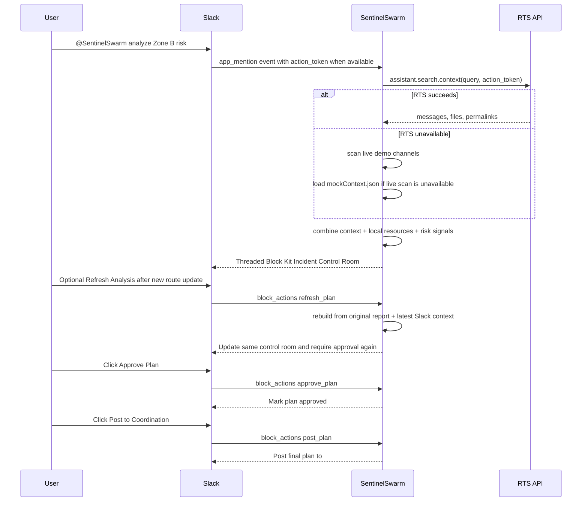
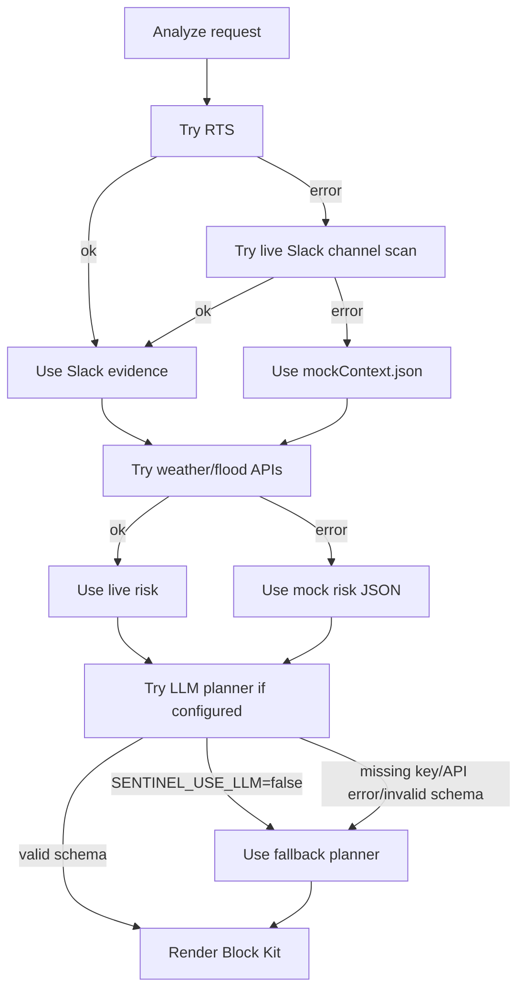

# Architecture

## Overview

SentinelSwarm is a Slack Socket Mode app. Slack is the primary interface; the backend receives app mentions and button actions, searches Slack context when possible, combines that with local operational data and weather/flood signals, then renders an Incident Control Room with human approval gates.

## Component Diagram

```mermaid
flowchart LR
  User["Responder in Slack"] --> Mention["@SentinelSwarm analyze Zone B risk"]
  Mention --> Slack["Slack Events API via Socket Mode"]
  Slack --> Bolt["Bolt JS App"]

  Bolt --> RTS["Real-Time Search: assistant.search.context"]
  RTS -->|success| Context["Retrieved Slack evidence"]
  RTS -->|failure or missing token| SlackScan["Live Slack channel scan"]
  SlackScan -->|success| Context
  SlackScan -->|failure| MockContext["mockContext.json"]

  Bolt --> LocalData["Local JSON: zones, routes, shelters, volunteers, supplies"]
  Bolt --> Weather["Open-Meteo Weather API"]
  Weather -->|failure| MockWeather["mockWeather.json"]
  Bolt --> Flood["Open-Meteo Flood API"]
  Flood -->|failure| MockFlood["mockFlood.json"]

  Context --> Planner["Planner Orchestrator"]
  MockContext --> Planner
  LocalData --> Planner
  Weather --> Planner
  MockWeather --> Planner
  Flood --> Planner
  MockFlood --> Planner

  Planner --> Fallback["Deterministic Fallback Planner"]
  Planner --> LLM["Optional Gemini Refinement"]
  LLM -->|valid JSON after schema check| Schema["Zod Plan Schema"]
  LLM -->|missing key, API failure, invalid schema| Fallback
  Fallback --> Schema

  Schema --> Blocks["Block Kit Incident Control Room"]
  Blocks --> Thread["Slack Thread Reply"]
  Thread --> Approve["Approve Plan Button"]
  Approve --> Post["Post to Coordination Button"]
  Post --> Coordination["#coordination final action plan"]
```

## Runtime Flow

1. User mentions the app in Slack.
2. Bolt receives an `app_mention` event through Socket Mode.
3. Handler extracts the zone and `action_token`.
4. RTS client tries `assistant.search.context`.
5. If RTS fails or returns weak results, SentinelSwarm scans the live demo channels.
6. If live channel scan fails or returns no useful results, local `mockContext.json` is used.
7. Local operational data is loaded from JSON.
8. Weather and flood tools fetch live data with short timeouts.
9. Mock weather/flood data replaces failed calls.
10. Planner creates a structured `IncidentPlan`. By default this is deterministic.
11. If `SENTINEL_USE_LLM=true`, the optional Gemini layer may refine the plan.
12. Zod validates the plan. Invalid LLM JSON is retried once for schema repair, then replaced by the deterministic fallback plan.
13. Block renderer creates a Slack Incident Control Room.
14. User approves the plan.
15. User posts the approved plan to `#coordination`.

## Slack Event Flow

## Approval Flow

The planner never posts final assignments directly.

Plan state should include:

- `planId`.
- `status`: `draft`, `approved`, or `posted`.
- `approvedBy`.
- `approvedAt`.
- `threadTs`.
- `coordinationChannelId`.

For the hackathon MVP, state can live in memory. If the process restarts, the user can rerun the analysis.

## Fallback Flow

## Planned Module Boundaries

- `src/app.ts`: bootstraps Bolt app.
- `src/config.ts`: validates env vars and feature flags.
- `src/slack/handlers.ts`: event and action handlers.
- `src/slack/rts.ts`: Real-Time Search wrapper.
- `src/slack/blocks.ts`: Block Kit rendering.
- `src/slack/postPlan.ts`: final coordination post.
- `src/tools/localData.ts`: JSON loading and validation.
- `src/tools/weather.ts`: Open-Meteo weather client with fallback.
- `src/tools/flood.ts`: Open-Meteo flood client with fallback.
- `src/planner/schema.ts`: Zod schemas.
- `src/planner/severity.ts`: severity scoring.
- `src/planner/fallbackPlanner.ts`: deterministic planner.
- `src/planner/llm.ts`: optional Gemini adapter.

## Environment Variables

- `SLACK_BOT_TOKEN`: `xoxb-` bot token.
- `SLACK_APP_TOKEN`: `xapp-` Socket Mode app token.
- `SLACK_SIGNING_SECRET`: optional for future HTTP mode.
- `SLACK_COORDINATION_CHANNEL_ID`: channel ID for final approved posts.
- `SENTINEL_FORCE_MOCKS`: set `false` for the live Zone B Slack demo; set `true` only for fallback rehearsal.
- `SENTINEL_USE_LLM`: optional feature flag. Keep `false` for the required demo path.
- `GOOGLE_API_KEY`: optional Gemini API key for the refinement layer. The app must run without it.
- `GEMINI_MODEL`: optional Gemini model name. Defaults to `gemini-3.5-flash`.
- `LOG_LEVEL`: app logging level.

## Optional Gemini Refinement Contract

The Gemini layer is a refinement path, not a dependency. The required demo must still work with `SENTINEL_USE_LLM=false` and no `GOOGLE_API_KEY`.

When enabled, the adapter calls the Gemini API using `GOOGLE_API_KEY` and `GEMINI_MODEL`, then validates the returned structured plan with Zod. If the key is missing, Gemini is unreachable, the response times out, or the JSON fails schema validation after one repair retry, the planner must use the deterministic fallback planner and label that status in the Block Kit card.

Privacy contract: the optional Gemini call redacts raw Slack user IDs, channel IDs, permalinks, and URLs before sending planning context to Google. The feature should remain disabled unless Slack reports are fictional or approved for Google, because the report text itself is still sent.
