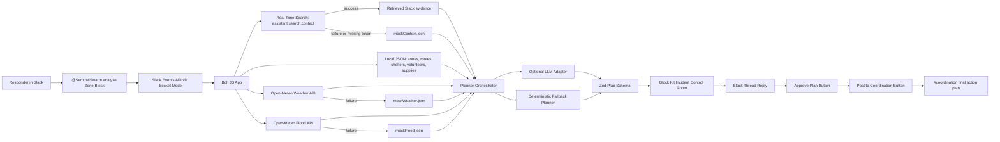
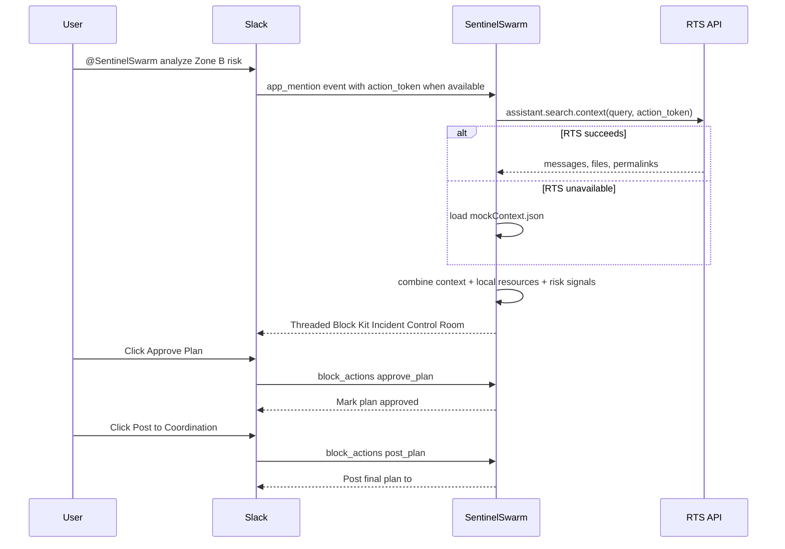
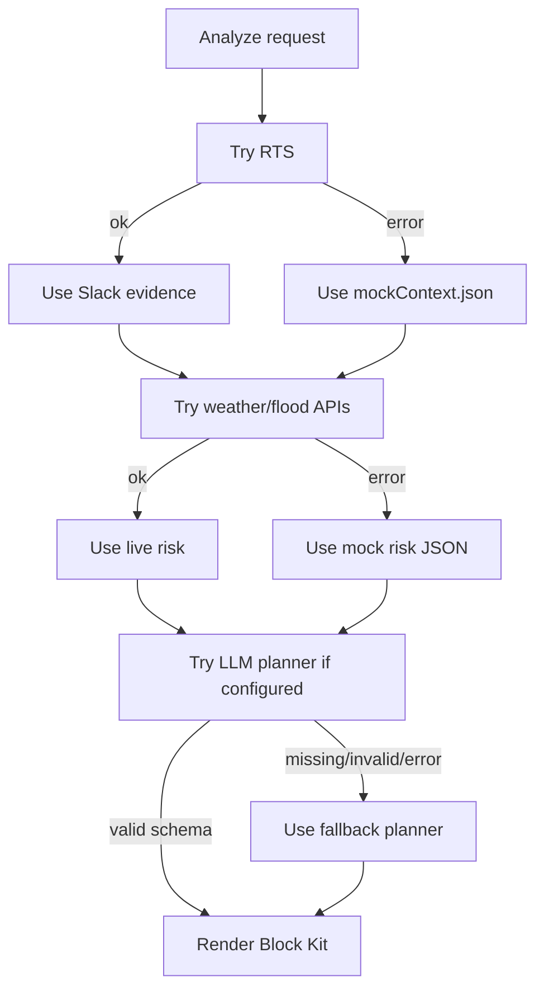

# Architecture

## Overview

SentinelSwarm is a Slack Socket Mode app. Slack is the primary interface; the backend receives app mentions and button actions, searches Slack context when possible, combines that with local operational data and weather/flood signals, then renders an Incident Control Room with human approval gates.

## Component Diagram

## Runtime Flow

1. User mentions the app in Slack.
2. Bolt receives an `app_mention` event through Socket Mode.
3. Handler extracts the zone and `action_token`.
4. RTS client tries `assistant.search.context`.
5. If RTS fails or returns weak results, local `mockContext.json` is used.
6. Local operational data is loaded from JSON.
7. Weather and flood tools fetch live data with short timeouts.
8. Mock weather/flood data replaces failed calls.
9. Planner creates a structured `IncidentPlan`.
10. Zod validates the plan.
11. Block renderer creates a Slack Incident Control Room.
12. User approves the plan.
13. User posts the approved plan to `#coordination`.

## Slack Event Flow

## Approval Flow

The planner never posts final assignments directly.

Plan state should include:

- `planId`.
- `status`: `draft`, `approved`, or `posted`.
- `approvedBy`.
- `approvedAt`.
- `threadTs`.
- `coordinationChannelId`.

For the hackathon MVP, state can live in memory. If the process restarts, the user can rerun the analysis.

## Fallback Flow

## Planned Module Boundaries

- `src/app.ts`: bootstraps Bolt app.
- `src/config.ts`: validates env vars and feature flags.
- `src/slack/handlers.ts`: event and action handlers.
- `src/slack/rts.ts`: Real-Time Search wrapper.
- `src/slack/blocks.ts`: Block Kit rendering.
- `src/slack/postPlan.ts`: final coordination post.
- `src/tools/localData.ts`: JSON loading and validation.
- `src/tools/weather.ts`: Open-Meteo weather client with fallback.
- `src/tools/flood.ts`: Open-Meteo flood client with fallback.
- `src/planner/schema.ts`: Zod schemas.
- `src/planner/severity.ts`: severity scoring.
- `src/planner/fallbackPlanner.ts`: deterministic planner.
- `src/planner/llm.ts`: optional LLM adapter.

## Environment Variables

- `SLACK_BOT_TOKEN`: `xoxb-` bot token.
- `SLACK_APP_TOKEN`: `xapp-` Socket Mode app token.
- `SLACK_SIGNING_SECRET`: optional for future HTTP mode.
- `SLACK_COORDINATION_CHANNEL_ID`: channel ID for final approved posts.
- `OPENAI_API_KEY`: optional; app must run without it.
- `SENTINEL_USE_LLM`: optional feature flag.
- `SENTINEL_FORCE_MOCKS`: force deterministic demo mode.
- `LOG_LEVEL`: app logging level.
