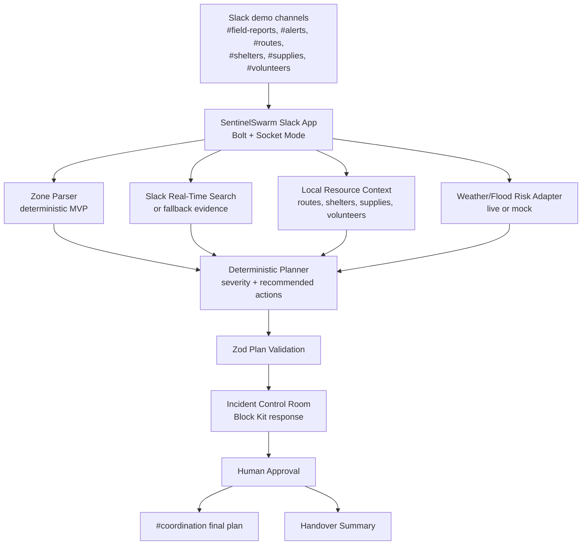

# Architecture Diagram

## Component Notes

Slack demo channels hold the fictional operating picture: reports, alerts, route status, shelter capacity, supplies, and volunteer availability.

SentinelSwarm Slack App receives mentions and button actions through Bolt and Socket Mode. This keeps the workflow inside Slack, where responders are already coordinating.

Zone Parser extracts the requested zone from the app mention. The current implementation uses deterministic zone parsing so the app can still operate without an LLM; richer urgency and constraint extraction is future work.

Slack Real-Time Search or fallback evidence provides the context used in the Evidence Ledger. If live context is unavailable, seeded mock context keeps the demo explainable.

Local Resource Context loads fictional routes, shelters, supplies, volunteers, and zones from JSON fixtures.

Weather/Flood Risk Adapter tries live risk inputs when available and uses mock risk data when external APIs are unavailable.

Deterministic Planner scores severity, selects route and resource recommendations, builds recommended actions, and creates a handover summary.

Zod Plan Validation keeps the planner output structured before it is rendered.

Incident Control Room is the Block Kit response shown in the Slack thread. It includes severity, confidence, evidence, routes, resources, recommended actions, and approval controls.

Human Approval prevents the system from posting final assignments automatically. A coordinator must approve the plan before it can be posted to `#coordination`.

## Failure Modes

- Real-Time Search unavailable -> mock context is used and the status line shows fallback context.
- Weather or flood unavailable -> mock risk data is used and the status line shows mock signals.
- LLM unavailable -> deterministic planner is used. The current core demo does not require an LLM.
- Slack interactivity issue -> the Incident Control Room remains visible in the thread, and the coordinator can still read the plan.
- Missing coordination channel configuration -> the plan remains in the source thread until the primary teammate completes Slack setup.

## Why Slack Is The Frontend

SentinelSwarm is built for teams that already coordinate through Slack during fast-moving incidents. Keeping the workflow in Slack means field reports, evidence, approval, and final coordination posts all remain in the same operational record. Judges can see that the output is not just a chatbot answer: it is a Slack-native coordination room with evidence, status indicators, human approval, and a final shared plan.
