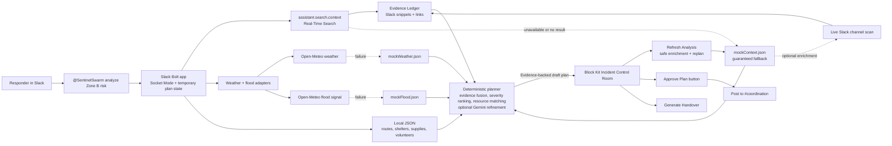

# Architecture Diagram

The submission-ready, editable source is [`assets/sentinelswarm-architecture.svg`](assets/sentinelswarm-architecture.svg). Convert that file to PNG, JPG, or PDF for the Devpost upload.

The Mermaid version below is kept as a compact, text-diffable reference for the same runtime architecture.

## Fallback Contract

- RTS failure: use `src/data/mockContext.json` as the guaranteed fallback, then apply optional live Slack channel enrichment when available.
- Weather failure: use `src/data/mockWeather.json`.
- Flood failure: use `src/data/mockFlood.json`.
- LLM failure or invalid JSON: use deterministic planner after one repair attempt.
- Planner output is validated with Zod before the Incident Control Room is rendered.
- Missing `SLACK_COORDINATION_CHANNEL_ID`: show a readable Slack setup hint and keep the plan in the source thread.

## Human-Control Boundary

SentinelSwarm analyzes evidence and recommends actions. It does not dispatch volunteers or post to `#coordination` until a coordinator explicitly approves the plan.
