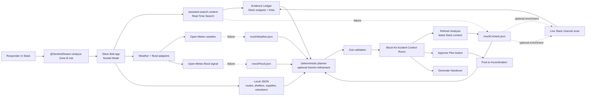

# Architecture Diagram

Use this diagram in the Devpost submission or as a quick screenshot during judging.

## Fallback Contract

- RTS failure: use `src/data/mockContext.json` as the guaranteed fallback, then enrich with live Slack channel scan when available.
- Weather failure: use `src/data/mockWeather.json`.
- Flood failure: use `src/data/mockFlood.json`.
- LLM failure or invalid JSON: use deterministic planner after one repair attempt.
- Missing `SLACK_COORDINATION_CHANNEL_ID`: show a readable Slack setup hint and keep the plan in the source thread.

## Human-Control Boundary

SentinelSwarm recommends a plan, but it does not dispatch volunteers or post final assignments until a coordinator clicks approval and then posts to `#coordination`.
