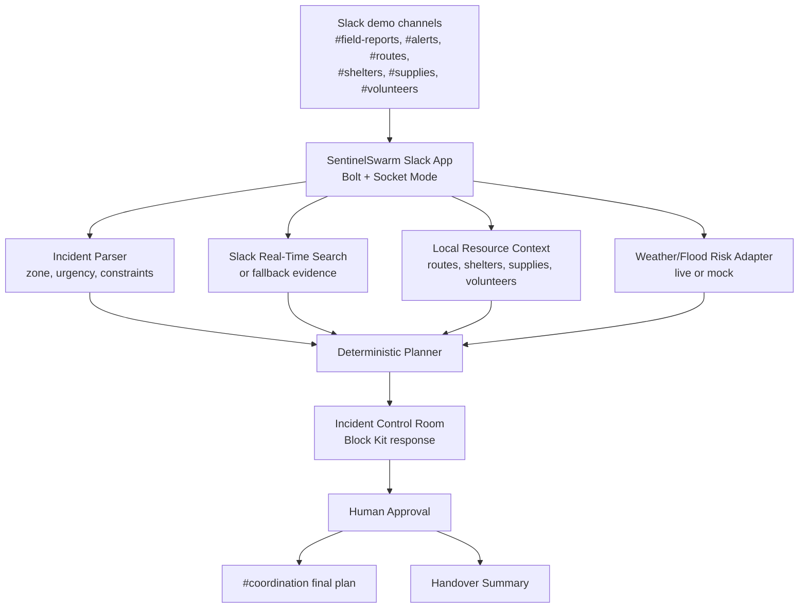

# Friend Agent Playbook

This file is the one-stop task brief for the second teammate and their coding agent.

If you are the teammate or an AI agent helping the teammate: read this file first, then execute the work here without needing Slack credentials or access to the live Slack workspace.

## Mission

Help SentinelSwarm become a hackathon-winning Slack Agent for Good by owning the judge-facing polish:

- realistic demo world and channel content
- Devpost submission story
- architecture diagram
- README and documentation polish
- 3-minute video script
- judge QA and demo checklist
- optional safe code improvements that do not require Slack credentials

The primary teammate will handle live Slack setup, channel invites, app installation, tokens, and manual Slack testing. Your work should make the project feel complete, credible, polished, and easy for judges to understand in under 3 minutes.

## Product Context

SentinelSwarm is a Slack-native crisis coordination agent for monsoon flood response.

The core demo flow:

```txt
#field-reports receives an incident report
-> SentinelSwarm analyzes the zone
-> Slack evidence, routes, shelters, volunteers, and supplies are summarized
-> A human coordinator approves the plan
-> The final plan is posted to #coordination
-> A handover summary can be generated
```

Target hackathon track:

```txt
Slack Agent for Good
```

The project should show:

- Slack-native workflow, not a generic chatbot.
- Social impact for disaster response teams, NGOs, campus safety teams, and mutual-aid groups.
- Evidence-linked recommendations.
- Human approval before action.
- Roadblock-safe fallbacks if external APIs fail.
- Clear use of Slack platform capabilities, especially Real-Time Search or a clearly labeled fallback.

## Non-Negotiable Guardrails

Do not touch secrets or live Slack configuration.

Never read, print, edit, commit, or ask for:

```txt
.env
.env.backup.local
SLACK_BOT_TOKEN
SLACK_APP_TOKEN
SLACK_SIGNING_SECRET
GOOGLE_API_KEY
```

Do not change:

```txt
manifest.yaml
docs/SLACK_SETUP.md
docs/MANUAL_SETUP.md
```

unless the primary teammate explicitly asks you to.

Do not claim a feature is complete unless it exists in the repo or is visible in the live Slack demo. If a feature is planned, label it as future work.

Use fictional crisis data only. Do not use real victims, real phone numbers, private addresses, or sensitive personal data.

## Setup After Cloning

Clone the repo:

```bash
git clone https://github.com/kaustubh-dot/SentinelSwarm.git
cd SentinelSwarm
```

Install dependencies:

```bash
npm install
```

Run local verification:

```bash
npm test
npm run build
```

You do not need Slack tokens for documentation, demo data, README work, or pure unit-testable code work.

Create a branch:

```bash
git checkout -b friend/submission-polish
```

Before finishing, run:

```bash
npm test
npm run build
git status --short
```

The status must not include `.env` or `.env.backup.local`.

## Required Deliverables

Complete these in order.

### 1. Demo Seed Message Pack

Create:

```txt
docs/DEMO_SEED_MESSAGES.md
```

Purpose:

Give the primary teammate ready-to-paste Slack messages that make the workspace feel alive before recording the demo.

The file must include:

- 2 polished demo scenarios.
- A primary scenario for Zone A.
- A backup scenario for Zone B.
- Ready-to-paste messages for these channels:
  - `#alerts`
  - `#field-reports`
  - `#routes`
  - `#shelters`
  - `#supplies`
  - `#volunteers`
  - `#coordination`
- A recommended order for pasting messages.
- The exact bot mention to trigger the demo.
- Notes on what the bot should infer from each channel.

Quality bar:

- Each message should sound like a real operations update.
- Messages should be short enough to read on video.
- Messages should contain concrete facts: zone, route, capacity, count, urgency, constraint.
- Avoid drama. The tone should be calm, operational, and credible.
- Include some conflicting information, such as one route blocked and another route open.
- Include enough facts for the bot to produce a strong plan.

Primary Zone A seed content to include or improve:

```txt
#alerts
Weather desk: rainfall intensity increasing near Zone A for the next 90 minutes. Low-lying lanes near the canal should be treated as high risk.

#field-reports
Zone A field update: water rising near Canal Road. 25 residents need evacuation support, including elderly residents and two children. Bridge access is blocked.

#routes
Route R2 over Canal Bridge is blocked by overflow and debris. Do not send volunteers through R2 until cleared.

#routes
Route R4 via East Bypass is open for emergency vehicles. Travel time to Zone A is about 18 minutes.

#shelters
Shelter S1 at Hill School has 80 free beds, generator backup, and drinking water for tonight.

#shelters
Shelter S2 is full and cannot accept new families until morning.

#supplies
Ward 12 storage has 120 water bottles, 45 blankets, 18 first-aid kits, and 6 portable lights ready for dispatch.

#volunteers
8 trained volunteers are available near Zone A. 3 have first-aid training, 2 have pickup vehicles, and 1 can coordinate phone check-ins.
```

Exact trigger:

```txt
@SentinelSwarm analyze Zone A risk: heavy rain near Zone A, water rising, 25 people need evacuation, route bridge blocked
```

Backup Zone B seed content to include or improve:

```txt
#alerts
Rainfall is expected to continue near Zone B until late evening. Monitor Riverside Lane and the old bus depot area.

#field-reports
Zone B update: knee-deep water near Riverside Lane. Two homes are requesting evacuation support. Elderly residents present.

#routes
Route R2 through Riverside Lane is blocked by debris and standing water. Avoid for the next 4 hours.

#routes
Route R4 via Hill School Road is open for light vehicles and is the safest path to the Zone B shelter.

#shelters
Hill School shelter has 18 spaces, blankets available, and needs drinking water by evening.

#supplies
Depot has 40 water cans, 25 blankets, and 12 first-aid kits. Driver available if route is confirmed.

#volunteers
Anika and Dev are available with a 4x4 from 5pm to 9pm. Both are first-aid trained.
```

Exact trigger:

```txt
@SentinelSwarm analyze Zone B risk
```

Acceptance criteria:

- A teammate can open `docs/DEMO_SEED_MESSAGES.md` and paste messages into Slack without asking follow-up questions.
- The primary and backup scenarios both support a complete incident plan.

### 2. Devpost Submission Draft

Create:

```txt
docs/DEVPOST_SUBMISSION_DRAFT.md
```

Purpose:

Give the team a near-final Devpost submission that can be copied into Devpost with light edits.

Required sections:

```txt
Project Title
One-Line Summary
Elevator Pitch
Problem
Solution
How It Works
How We Built It
How We Use Slack
Social Impact
Technical Architecture
Roadblock-Safe Fallbacks
Challenges We Ran Into
Accomplishments
What We Learned
What Is Next
Built With
Demo Video Notes
```

Recommended title:

```txt
SentinelSwarm
```

Recommended one-line summary:

```txt
SentinelSwarm is a Slack-native crisis coordination agent that turns scattered flood-response updates into an evidence-linked, human-approved action plan.
```

Key claims to make:

- Crisis response data is often scattered across chat channels.
- SentinelSwarm keeps the workflow inside Slack.
- The agent searches or uses evidence from Slack context.
- The output is an Incident Control Room, not just a chat reply.
- Human approval is required before posting an action plan.
- The system has deterministic fallback behavior so demos and operations are not blocked by one API failure.

Claims to avoid unless implemented:

- Do not say it dispatches emergency services.
- Do not say it predicts floods with certified accuracy.
- Do not say it is production-ready for life-critical use.
- Do not say it has real-time government disaster data unless implemented.
- Do not say MCP is fully integrated unless that code exists.

Strong wording to use:

```txt
SentinelSwarm is a decision-support agent, not an autonomous emergency dispatcher.
```

```txt
The system keeps humans in control while reducing time lost searching across channels.
```

```txt
The demo is designed to degrade gracefully: when live context is unavailable, the deterministic fallback planner still produces a complete, explainable plan.
```

Acceptance criteria:

- The draft is readable by a non-engineer.
- It clearly maps to the Slack Agent for Good track.
- It explains impact without exaggerating.
- It includes a concise technical story for judges.

### 3. Architecture Diagram

Create:

```txt
docs/ARCHITECTURE_DIAGRAM.md
```

Purpose:

Give Devpost and the video a clean architecture explanation.

Include a Mermaid diagram like this, then improve labels if useful:



Also include:

- A short paragraph explaining each component.
- A "Failure mode" section:
  - Real-Time Search unavailable -> mock context.
  - Weather/flood unavailable -> mock risk data.
  - LLM unavailable -> deterministic planner.
  - Slack interactivity issue -> plan still visible in thread.
- A "Why Slack is the frontend" section.

Acceptance criteria:

- The diagram can be screenshot for Devpost.
- A judge can understand the system in 30 seconds.
- The diagram does not mention secrets or token values.

### 4. Demo Video Storyboard

Create:

```txt
docs/DEMO_VIDEO_STORYBOARD.md
```

Purpose:

Make recording the 3-minute demo almost mechanical.

Required structure:

```txt
Recording Setup
Scene 1: Problem
Scene 2: Workspace Context
Scene 3: Incident Report
Scene 4: Incident Control Room
Scene 5: Human Approval
Scene 6: Coordination Post
Scene 7: Impact Close
Backup Takes
What Not To Show
```

Target length:

```txt
2:45 to 3:00
```

Include exact narration. Use this as a starting point:

```txt
During a flood response, critical information gets scattered across Slack: field reports, routes, shelter capacity, supplies, alerts, and volunteer availability. SentinelSwarm turns that scattered context into a single evidence-linked action plan, while keeping a human coordinator in control.
```

Demo path:

```txt
1. Show Slack channels with seeded messages.
2. Open #field-reports.
3. Mention SentinelSwarm with the Zone A trigger.
4. Show the Incident Control Room.
5. Point to evidence, severity, route, shelter, supplies, and volunteers.
6. Click Approve Plan.
7. Click Post to Coordination.
8. Open #coordination and show the final plan.
9. Close with social impact and fallback reliability.
```

Include on-screen callouts the presenter should mention:

- "Evidence-linked"
- "Human-approved"
- "Slack-native"
- "Fallback-safe"
- "Built for response teams, NGOs, and campus safety"

Acceptance criteria:

- A teammate can record the video using only this file and the live Slack app.
- The script fits within 3 minutes.
- The story shows why this is more than a chatbot.

### 5. Judge QA Sheet

Create:

```txt
docs/JUDGE_QA.md
```

Purpose:

Prepare crisp answers to likely judge questions.

Include at least these questions and answers:

```txt
What makes this different from ChatGPT in Slack?
How does SentinelSwarm use Slack-specific capabilities?
Why is human approval required?
What happens if Real-Time Search or external APIs fail?
Who would use this?
What is the social impact?
How would this scale beyond the demo?
What are the safety limitations?
What did the team build during the hackathon?
What would you add next?
```

Answer style:

- 2 to 5 sentences per answer.
- Specific, not fluffy.
- Honest about limitations.
- Strong on impact and implementation.

Suggested answer for "What makes this different from ChatGPT in Slack?":

```txt
SentinelSwarm is workflow-specific. It does not just answer a question; it pulls together field reports, routes, shelters, volunteers, and supplies into a structured Incident Control Room with evidence and approval steps. The coordinator can approve and publish a final plan back into Slack, so the output becomes part of the team's operational workflow.
```

Acceptance criteria:

- Answers are demo-ready.
- The primary teammate can use them during Devpost writing or a judging call.

### 6. README Polish

Update:

```txt
README.md
```

Purpose:

Make the GitHub repo look complete and judge-friendly.

Add or improve:

- concise project description
- "Why Slack" section
- demo flow
- architecture summary
- setup instructions
- environment variable list using placeholder values only
- roadblock-safe fallback explanation
- docs links
- project status
- future work

Do not include real tokens.

Recommended README outline:

```txt
# SentinelSwarm
## What It Does
## Why It Matters
## Demo Flow
## Architecture
## Roadblock-Safe Design
## Setup
## Environment Variables
## Test
## Documentation
## Future Work
## Safety Note
```

Acceptance criteria:

- A judge opening GitHub understands the project in 60 seconds.
- Setup steps are accurate.
- Docs are linked.
- No secret values are present.

### 7. Submission Checklist Update

Update:

```txt
docs/SUBMISSION_CHECKLIST.md
```

Purpose:

Make sure the final submission does not miss required assets.

Add checklist items for:

- Devpost text completed.
- Demo video recorded and under 3 minutes.
- Architecture diagram attached.
- GitHub repo public or accessible if required.
- Slack developer sandbox URL available.
- Required judge access granted by primary teammate.
- App ID recorded by primary teammate.
- Screenshots captured.
- No secrets committed.
- `npm test` passes.
- `npm run build` passes.

Acceptance criteria:

- The team can use the checklist on submission day without needing to reread all docs.

## Optional High-Impact Code Tasks

Do these only after the required documentation deliverables are complete.

These tasks do not require Slack tokens if implemented as pure functions plus tests.

### Optional A: Natural-Language Incident Parser

Goal:

Make the bot feel smarter by extracting incident details from natural language.

Suggested files:

```txt
src/planner/incidentParser.ts
tests/incidentParser.test.ts
```

The parser should extract:

- zone name
- estimated people affected
- route blockage mention
- water/rain severity hints
- vulnerable people hints
- requested action

Example input:

```txt
heavy rain near Zone A, water rising, 25 people need evacuation, route bridge blocked
```

Example output:

```ts
{
  zoneName: "Zone A",
  affectedPeople: 25,
  routeBlocked: true,
  hazards: ["heavy rain", "rising water", "blocked route"],
  requestedAction: "evacuation"
}
```

Acceptance criteria:

- Unit tests cover Zone A and Zone B.
- The parser is deterministic.
- The app can still work if parsing finds only a zone.

### Optional B: Demo Scenario Fixtures

Goal:

Make demo scenarios reusable in tests and docs.

Suggested files:

```txt
src/data/demoScenarios.json
tests/demoScenarios.test.ts
```

Include:

- Zone A primary scenario.
- Zone B backup scenario.
- expected key facts for each scenario.

Acceptance criteria:

- JSON validates in tests.
- Scenario facts match the demo seed message docs.

### Optional C: Block Kit Content Test

Goal:

Prevent the Slack response from losing important judge-visible sections.

Suggested test:

```txt
tests/blocksContent.test.ts
```

Assert that rendered blocks include:

- Incident Control Room title
- Evidence Ledger
- severity
- route
- shelter
- supplies
- volunteers
- human approval or approval button

Acceptance criteria:

- `npm test` passes.
- The test catches accidental removal of key demo content.

## Final Quality Checklist

Before handing work back:

```bash
npm test
npm run build
git status --short
```

Check:

- No `.env` file appears in status.
- No real token appears in diffs.
- Docs are internally consistent.
- Devpost draft does not exaggerate unbuilt features.
- Demo script fits under 3 minutes.
- Architecture diagram explains Slack, backend, context, planner, approval, and coordination.

Also run a simple secret-pattern scan before committing:

```bash
git grep -n "xoxb-" -- .
git grep -n "xapp-" -- .
git grep -n "GOOGLE_API_KEY=" -- .
```

The only acceptable matches should be placeholders or explanatory docs, never real values.

## Suggested Commit

Use a focused commit message:

```bash
git add README.md docs
git commit -m "Add judge-ready submission and demo playbook"
```

If optional code tasks are included:

```bash
git add README.md docs src tests
git commit -m "Polish demo docs and add scenario parsing support"
```

## Handoff Note Template

When finished, send this summary to the primary teammate:

```txt
Completed:
- Demo seed message pack:
- Devpost draft:
- Architecture diagram:
- Demo video storyboard:
- Judge QA:
- README polish:
- Submission checklist:
- Optional code tasks:

Verification:
- npm test:
- npm run build:
- Secret check:

Important notes:
- Anything the live Slack tester must verify:
- Any claims that should stay marked as future work:
```

## North Star

The winning version of SentinelSwarm should feel like this:

```txt
It is not a chatbot answering a disaster question.
It is a Slack-native coordination room that turns scattered response chatter into a traceable, human-approved plan.
```
